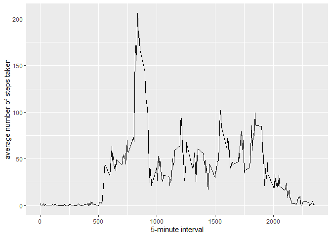

## Loading and preprocessing the data


```r
data = read.csv("activity.csv", header = TRUE, sep = ",", col.names = c("steps", "date", "interval"))
```


## What is mean total number of steps taken per day?


```r
library(ggplot2)
stepsEachDay <- tapply(data$steps, data$date, FUN = sum, na.rm = TRUE)
qplot(stepsEachDay, binwidth = 1000, xlab = "total number of steps taken each day", ylab = "Frequency")
```

<!-- -->

```r
mean(stepsEachDay, na.rm = TRUE)
```

```
## [1] 9354.23
```

```r
median(stepsEachDay, na.rm = TRUE)
```

```
## [1] 10395
```

## What is the average daily activity pattern?


```r
avgSteps <- aggregate(x=list(aSteps=data$steps), by=list(interval=data$interval), FUN=mean, na.rm=TRUE)
ggplot(data=avgSteps, aes(x=interval, y=aSteps)) + geom_line() + xlab("5-minute interval") + ylab("average number of steps taken")
```

<!-- -->

```r
avgSteps[which.max(avgSteps$aSteps), ]
```

```
##     interval   aSteps
## 104      835 206.1698
```

## Imputing missing values

- Missing Values

```r
length(which(is.na(data$steps)))
```

```
## [1] 2304
```


- Imputing

```r
completedData <- data
completedData$steps <- impute(data$steps, fun=mean)
stepsEachDay <- tapply(completedData$steps, completedData$date, FUN = sum, na.rm = TRUE)
print(qplot(stepsEachDay, binwidth = 1000, xlab = "total number of steps taken each day", ylab = "Frequency"))
```

<!-- -->

```r
mean(stepsEachDay, na.rm = TRUE)
```

```
## [1] 10766.19
```

```r
median(stepsEachDay, na.rm = TRUE)
```

```
## [1] 10766.19
```

## Are there differences in activity patterns between weekdays and weekends?

```r
weekdayOrweekend <- function(date) {
    day <- weekdays(date)
    if (day %in% c("Monday", "Tuesday", "Wednesday", "Thursday", "Friday")) 
        return("weekday") else if (day %in% c("Saturday", "Sunday")) 
            return("weekend") else stop("invalid date")
}
completedData$date <- as.Date(completedData$date)
completedData$day <- sapply(completedData$date, FUN = weekdayOrweekend)
averages <- aggregate(steps ~ interval + day, data = completedData, mean)
print(ggplot(averages, aes(interval, steps)) + geom_line() + facet_grid(day ~ .) + 
    xlab("5-minute interval") + ylab("Number of steps"))
```

<!-- -->
